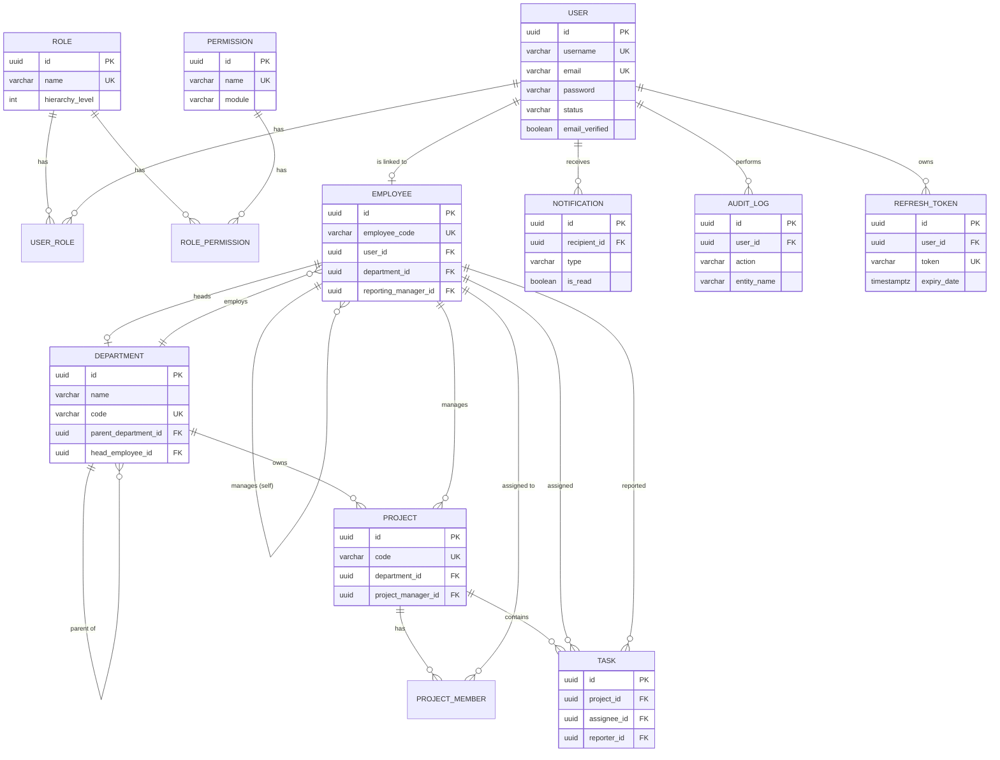

# Database Design

## 1. Entity Relationship Diagram

## 2. Normalization

The schema is normalized to **Third Normal Form (3NF)**:

- **1NF** — every column holds a single atomic value; there are no repeating
  groups (multi-valued attributes such as a user's roles or a project's
  members are modeled as separate join tables, `user_roles` and
  `project_members`, rather than as delimited strings).
- **2NF** — every table has a single-column surrogate key (`UUID id`), so
  there are no partial dependencies to worry about; composite keys only
  appear on pure join tables (`user_roles`, `role_permissions`,
  `project_members`), whose non-key columns are the FK pair itself.
- **3NF** — non-key columns depend only on the primary key, not on each
  other. For example, `employees.department_id` stores a reference rather
  than duplicating the department name, and `tasks` never stores a project
  name, only `project_id`.

Two intentional denormalizations exist for performance and audit
correctness, and both are documented here rather than left implicit:

- `audit_logs.old_value` / `new_value` store JSON snapshots rather than
  normalized diff rows, because audit rows must remain readable even after
  the referenced entity changes shape.
- `notifications.reference_id` / `reference_type` is a polymorphic
  reference (no FK constraint) because a notification can point at a task,
  a project, or an employee. Referential integrity for this column is
  enforced in the service layer, not the database.

## 3. Primary Keys

Every table uses a `UUID` surrogate primary key generated by the
application (`GenerationType.UUID`, backed by Java's `UUID.randomUUID()`
through Hibernate 6). UUIDs were chosen over auto-incrementing `BIGSERIAL`
identifiers for three reasons relevant to a multi-tenant control plane:

1. IDs can be generated client-side before the row is persisted, which
   simplifies batch inserts and event publishing (a Kafka event can carry
   the entity's final ID even before the transaction commits).
2. IDs never leak sequential information about how many records exist,
   which matters once employee counts or project counts are exposed
   through the API.
3. IDs are safe to merge across environments (for example, replaying
   staging data into a local database) without collisions.

## 4. Foreign Keys and Relationships

| Child table         | FK column               | Parent table  | On Delete   |
|----------------------|--------------------------|---------------|-------------|
| user_roles            | user_id                 | users         | CASCADE     |
| user_roles            | role_id                 | roles         | CASCADE     |
| role_permissions       | role_id                 | roles         | CASCADE     |
| role_permissions       | permission_id           | permissions   | CASCADE     |
| employees              | user_id                 | users         | RESTRICT    |
| employees              | department_id            | departments   | SET NULL    |
| employees              | reporting_manager_id     | employees     | SET NULL    |
| departments            | parent_department_id     | departments   | SET NULL    |
| departments            | head_employee_id         | employees     | SET NULL    |
| projects               | department_id            | departments   | SET NULL    |
| projects               | project_manager_id       | employees     | SET NULL    |
| project_members        | project_id               | projects      | CASCADE     |
| project_members        | employee_id              | employees     | CASCADE     |
| tasks                  | project_id               | projects      | CASCADE     |
| tasks                  | assignee_id              | employees     | SET NULL    |
| tasks                  | reporter_id              | employees     | SET NULL    |
| notifications           | recipient_id             | users         | CASCADE     |
| audit_logs              | user_id                  | users         | SET NULL    |
| refresh_tokens          | user_id                  | users         | CASCADE     |

`employees.user_id` uses `ON DELETE RESTRICT` deliberately: a user account
must be explicitly deactivated (soft state change) before the underlying
employee record can be removed, preventing accidental loss of employment
history through a cascading user deletion.

`departments.head_employee_id` is added through an `ALTER TABLE` statement
after the `employees` table is created, because `departments` and
`employees` reference each other and one of the two foreign keys has to be
deferred to break the circular creation order.

## 5. Indexing Strategy

Indexes were added based on the access patterns the API actually needs,
not speculatively on every column:

- **Uniqueness indexes** back every natural key that the application looks
  up during authentication or de-duplication: `users.username`,
  `users.email`, `roles.name`, `permissions.name`, `departments.code`,
  `employees.employee_code`, `projects.code`, `refresh_tokens.token`.
- **Foreign key indexes** exist on every FK column that is filtered on
  directly, such as `tasks.project_id`, `tasks.assignee_id`,
  `employees.department_id`, `projects.department_id`. Postgres does not
  automatically index foreign keys, so these are declared explicitly.
- **Composite index** `idx_notifications_recipient_read` on
  `(recipient_id, is_read)` supports the single most frequent notification
  query in the product: "unread notifications for the current user",
  without scanning every notification a user has ever received.
- **Status/date indexes** — `tasks.status`, `tasks.due_date`,
  `projects.status`, `users.status` — support dashboard filtering and the
  scheduled jobs that scan for overdue tasks or dormant accounts.
- `audit_logs.created_at` is indexed because audit queries are almost
  always time-bounded ("show me everything in the last 7 days").

## 6. Optimistic Locking and Auditing

Every table carries `version`, `created_at`, `updated_at`, `created_by`
and `updated_by` columns inherited from `BaseEntity`. `version` backs
JPA's `@Version` optimistic locking so two concurrent updates to the same
row (for example two managers editing the same task) fail fast with an
`OptimisticLockException` instead of silently overwriting each other's
changes.
