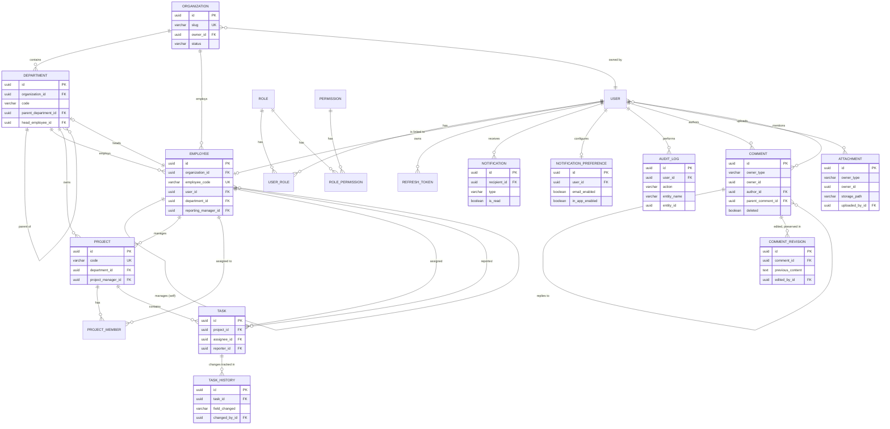

# Entity Relationship Diagram

This is the complete schema as of the final production release. For the
original phase 1 core (users/roles/permissions/departments/employees/
projects/tasks) with full normalization notes, see
[`database-design.md`](database-design.md); this document adds
everything built in the phases since — organizations, comments,
attachments, notifications and audit.

## Notes on the polymorphic tables

`COMMENT.owner_type`/`owner_id` and `ATTACHMENT.owner_type`/`owner_id` are
deliberately **not** foreign keys — a comment or attachment can belong to
a `TASK`, `PROJECT` or (for attachments) `EMPLOYEE` record, and Postgres
doesn't support a foreign key that conditionally points at one of several
tables. Referential integrity for these two columns is enforced in the
service layer (`CommentServiceImpl`, `AttachmentServiceImpl`) rather than
the database — the same trade-off already documented in
[`database-design.md`](database-design.md) for `notifications.reference_id`,
applied consistently across every polymorphic reference in the schema.
