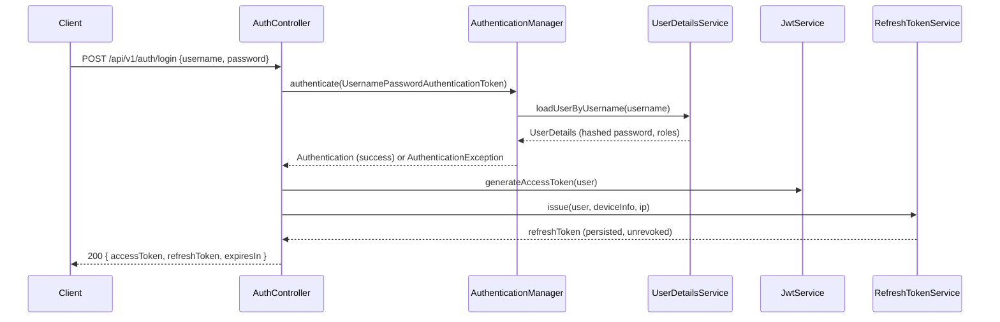
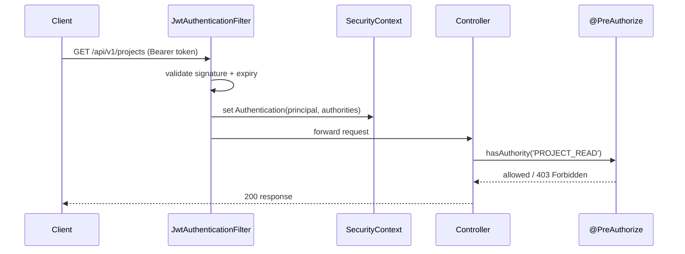
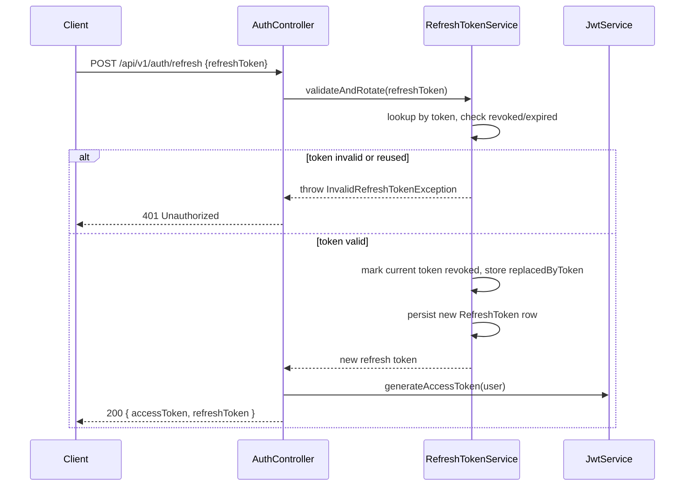

# Security Architecture

## 1. Overview

Authentication is stateless and token based. The API never uses server
side sessions or `HttpSession`; every request carries a signed JWT in the
`Authorization: Bearer <token>` header, and Spring Security's filter chain
validates it on every call. Refresh tokens are the one exception — they
are opaque, stored server-side, and rotated on every use.

## 2. Token Types

| Token          | Format               | Lifetime (default) | Storage                        | Purpose                                   |
|----------------|-----------------------|---------------------|----------------------------------|--------------------------------------------|
| Access token    | JWT (HS256)           | 15 minutes           | Client memory / secure storage    | Authorizes API calls                        |
| Refresh token   | Opaque random string   | 7 days                | `refresh_tokens` table + client     | Exchanged for a new access token             |

Access tokens are short-lived on purpose: if one is intercepted, the
exposure window is minutes, not days. The refresh token is what actually
carries session longevity, and because it is opaque and stored server
side, it can be revoked instantly (logout, password change, suspicious
activity) without waiting for it to expire.

## 3. JWT Claims

```json
{
  "sub": "a1b2c3d4-...-userId",
  "username": "jane.doe",
  "roles": ["MANAGER"],
  "permissions": ["PROJECT_READ", "PROJECT_UPDATE", "TASK_CREATE"],
  "iss": "backend-control-plane",
  "iat": 1732000000,
  "exp": 1732000900
}
```

Permissions are flattened into the token at issuance time so that
authorization checks on each request are a pure in-memory set lookup —
no database round trip is required to answer "can this user do X". The
trade-off is accepted deliberately: if a permission is revoked mid-session,
it takes effect the next time the access token is refreshed (at most 15
minutes later), not instantly. This is called out explicitly because it is
the kind of trade-off an interviewer will ask about.

## 4. Authentication Flow



Failed login attempts increment `users.failed_login_attempts`. Once the
configured threshold (`app.security.max-failed-login-attempts`, default 5)
is reached, the account is locked for
`app.security.account-lock-duration-minutes` (default 30) by setting
`users.account_locked_until`, and every attempt — successful or not — is
written to `audit_logs` with action `LOGIN` or `LOGIN_FAILED`.

## 5. Authorization Flow



`JwtAuthenticationFilter` runs once per request, before
`UsernamePasswordAuthenticationFilter`, and is the only place a raw JWT is
parsed. Once the filter populates the `SecurityContext`, the rest of the
application — controllers, services, `@PreAuthorize` expressions — deals
exclusively with the resulting `Authentication` object, never with the
token itself.

Every permission from the JWT is mapped to a Spring Security
`GrantedAuthority`. Controllers declare intent with method-level security:

```java
@PreAuthorize("hasAuthority('PROJECT_DELETE')")
@DeleteMapping("/{id}")
public ResponseEntity<Void> delete(@PathVariable UUID id) { ... }
```

## 6. Role Hierarchy

Roles are ordered by `hierarchy_level` so that a higher role implicitly
carries the authorities of every role beneath it, configured through
Spring Security's `RoleHierarchy`:

```
SUPER_ADMIN (100)
   > ADMIN (80)
      > MANAGER (60)
         > EMPLOYEE (40)
            > VIEWER (20)
```

This is expressed once, centrally, in `RoleHierarchyConfig`, rather than
duplicated across every `@PreAuthorize` annotation:

```
ROLE_SUPER_ADMIN > ROLE_ADMIN
ROLE_ADMIN > ROLE_MANAGER
ROLE_MANAGER > ROLE_EMPLOYEE
ROLE_EMPLOYEE > ROLE_VIEWER
```

In practice, fine-grained checks in this codebase use permissions
(`hasAuthority('TASK_CREATE')`) rather than roles
(`hasRole('MANAGER')`), because permissions describe *what* an action does
while roles describe *who* typically does it — permissions are what
actually change as the product evolves. The role hierarchy exists mainly
for coarse checks (dashboard visibility, admin-only endpoints) and for
keeping the seeded role/permission matrix in `V2__seed_roles_and_permissions.sql`
sensible.

## 7. Refresh Token Rotation



Rotation is one-time-use: presenting a refresh token issues a brand new
one and immediately revokes the old one (`revoked = true`,
`replaced_by_token` set for traceability). If a refresh token is presented
a second time, this is treated as a signal that the token was stolen and
replayed — the service revokes every active refresh token belonging to
that user and forces re-authentication on all devices.

## 8. Password Reset and Email Verification

Both flows follow the same pattern: a single-use, time-boxed token cached
in Redis (not the relational database, since these tokens are short-lived
and high-volume) and emailed to the user.

- **Forgot password** — `POST /api/v1/auth/forgot-password` generates a
  UUID token, stores it in Redis with a TTL of
  `app.security.password-reset-token-expiration-minutes` (default 30)
  mapped to the user id, and emails a reset link. `POST
  /api/v1/auth/reset-password` validates the token, updates
  `users.password` (BCrypt, strength 12), stamps
  `password_changed_at`, and revokes every outstanding refresh token for
  that user so existing sessions cannot outlive a compromised password.
- **Email verification** — issued at registration with a TTL of
  `app.security.email-verification-token-expiration-hours` (default 24).
  Until it is consumed, `users.status` stays
  `PENDING_VERIFICATION` and login is rejected with a dedicated error
  code so the frontend can offer to resend the email rather than showing
  a generic "invalid credentials" message.

## 9. Password Storage

Passwords are hashed with BCrypt (`BCryptPasswordEncoder`, strength 12)
via Spring Security's `PasswordEncoder` abstraction. Plaintext passwords
are never logged — `User.toString()` explicitly excludes the `password`
field, and request logging is configured to mask the `password` and
`newPassword` JSON fields.

## 10. CORS and Transport Security

CORS is restricted to the origins listed in `app.cors.allowed-origins`
(the React frontend's URL in development, the production domain in
production). In production, the API is only ever served behind TLS
termination (see `docs/deployment-guide.md`, added in a later phase), so
`Secure` cookie flags and HSTS are enforced at the reverse proxy layer.
