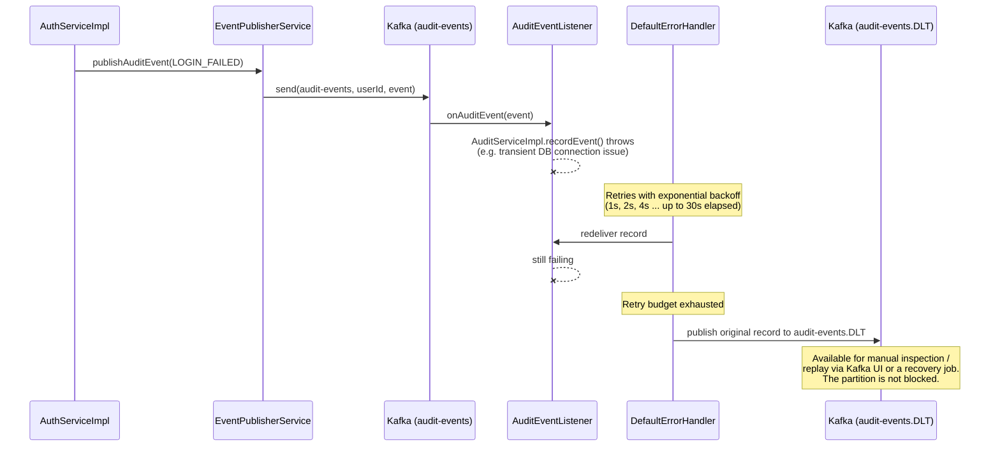
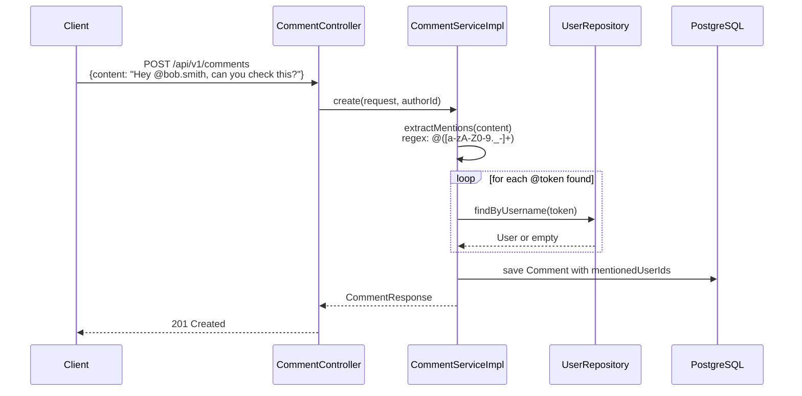

# Sequence Diagrams

Authentication, refresh token rotation and the login/authorization
sequences are already diagrammed in
[`security-architecture.md`](security-architecture.md). This document
covers the event-driven flows added in the infrastructure phase —
notifications, audit logging, and their dead-letter handling.

## 1. Task assignment → notification (happy path)

```mermaid
sequenceDiagram
    participant Client
    participant TaskController
    participant TaskServiceImpl
    participant EventPublisherService
    participant Kafka as Kafka (notification-events)
    participant Listener as NotificationEventListener
    participant NotificationServiceImpl
    participant DB as PostgreSQL
    participant EmailServiceImpl

    Client->>TaskController: PUT /api/v1/tasks/{id}/assign
    TaskController->>TaskServiceImpl: assign(id, request, requesterId)
    TaskServiceImpl->>DB: save Task, save TaskHistory
    TaskServiceImpl-->>TaskController: TaskResponse
    TaskController-->>Client: 200 OK

    Note over TaskServiceImpl,Kafka: Notification publishing shown for a<br/>representative flow; wired the same way<br/>from AuthServiceImpl for auth events.
    TaskServiceImpl->>EventPublisherService: publishNotificationEvent(TASK_ASSIGNED)
    EventPublisherService->>Kafka: send(notification-events, recipientId, event)

    Kafka->>Listener: onNotificationEvent(event)
    Listener->>NotificationServiceImpl: createFromEvent(...)
    NotificationServiceImpl->>DB: load NotificationPreference
    alt in-app enabled
        NotificationServiceImpl->>DB: save Notification
    end
    alt email enabled
        NotificationServiceImpl->>EmailServiceImpl: sendNotificationEmail(...)
        EmailServiceImpl-->>EmailServiceImpl: send via SMTP (async)
    end
```

The client's request completes as soon as the task is saved — publishing
to Kafka happens after the response is already on its way back, and the
consumer-side work (checking preferences, writing the notification,
sending an email) happens entirely out of the request's critical path.

## 2. Audit event with consumer failure → dead letter



This is exactly the mechanism `KafkaConsumerConfig` implements: every
`@KafkaListener` in the app shares the same `DefaultErrorHandler`, so
both `NotificationEventListener` and `AuditEventListener` get retry +
dead-letter behavior for free rather than each hand-rolling their own
try/catch.

## 3. Comment with @mention



Mention resolution is best-effort: a `@token` that doesn't match a real
username is simply not added to `mentionedUserIds` rather than rejecting
the comment, since free-text content legitimately contains `@` for other
reasons (email addresses, social handles quoted from elsewhere).
